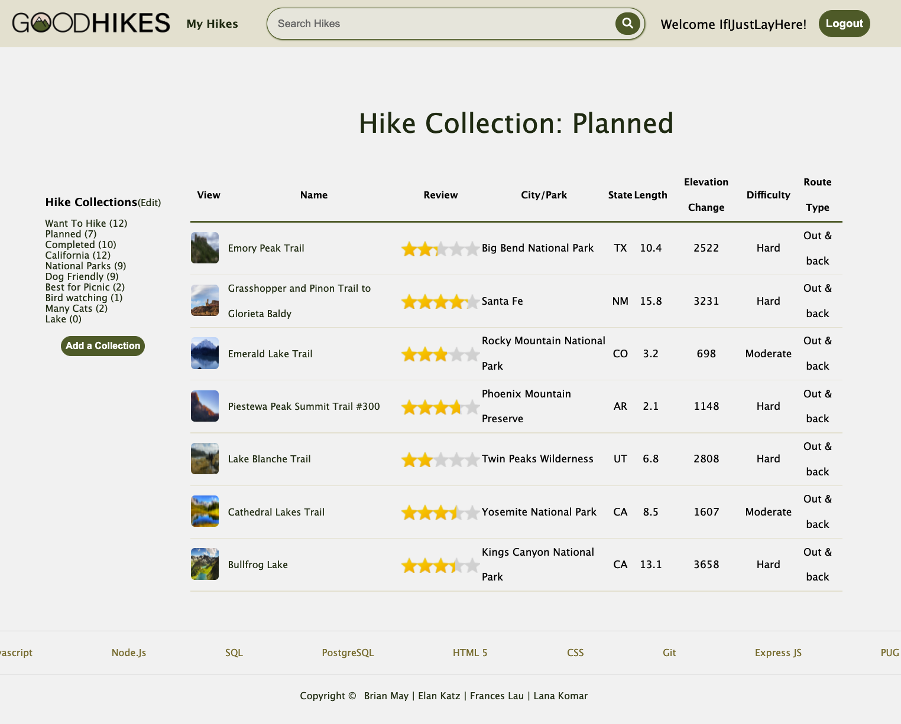
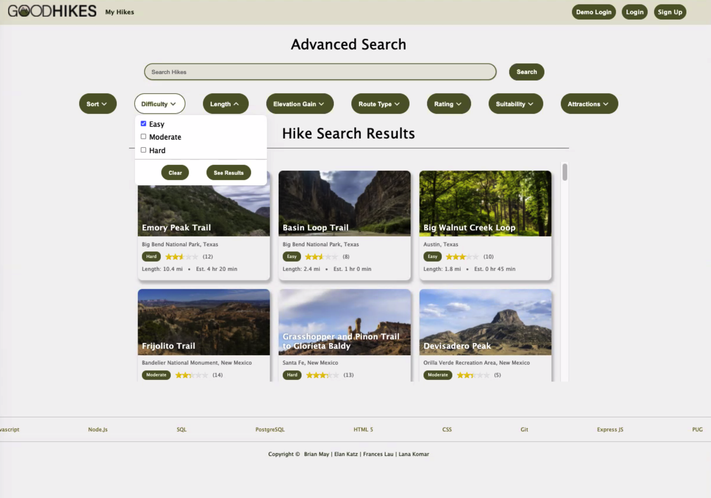

# Good Hikes

Inspired by GoodReads and AllTrails, Good Hikes is a full stack web application with a focus on usability that allows users to browse hikes, manage hike collections and review hikes in the USA.

Currently, Good Hikes is seeded with 60 trails all over the United States. Users `DemoUser` and `Ansel Adams` love Good Hikes so much that they visited every trail on Good Hikes and left multiple comments on each.

## Live Site:

https://good-hikes.herokuapp.com/

## Main Stack Technologies:

- Javascript, Pug, Plain old vanilla CSS3, Express, Sequelize, PostgreSQL

## Features:

#### User Auth:

- Create an account or sign in and log out
- Sign in as a Demo User to access full site functionality

#### Reviews/Ratings:

- View 10 most recent reviews/ratings for a hike and post a review
- Edit or delete your own reviews/ratings

#### Collections:

- View your collections on the 'My Hikes' page
- Customize your collections via add, edit and delete forms

#### Search:

- All Users can explore hikes via a combination of free text input
- Multiple filters can be applied/removed to refine results

## Good Hikes in Action:

**_<h4 align="center"> Splash Page, Login and Hike Page </h4>_**

**_<h4 align="center">Reviewing a Hike </h4>_**

**_<h4 align="center">My Hikes / Collections </h4>_**

**_<h4 align="center"> Advanced Search </h4>_**

## Application Architecture Overview

- Good Hikes utilizes Express to serve HTML content generated via the Pug HTML template engine.
- Data is stored in PostgreSQL, an open-source object-relational database.
- For updates to pages, Good Hikes takes a hybrid approach with about 50% of updates utilizing server side rendering of new HTML. While the other 50% utilizes AJAX to fetch relevant data from the backend and frontend javascript to dynamically update portions of the DOM without refreshing the page to improve site reactivity and the user experience.

### Frontend Technologies Used:

Pug:

- Web pages of Good Hikes are rendered server side via Pug.js, a template engine for Node.js. Pug allows for the creation of dynamic reusable content.

CSS:

- Good Hikes uses vanilla CSS to style all of the HTML documents, including interactive buttons and dropdown menus.

Javascript:

- To improve user experience, Good Hikes uses Javascript to create a responsive experience.

### Backend Technologies Used:

Express.js:

- The server of Good Hikes is set up with Express JS. Express is a minimal and flexible Node.js web application framework that provides a robust set of features for web applications while allowing for maintainable DRY code.

Express session:

- Good Hikes chose to use Express Sessions to create and manage session cookies on the user's browser.

Express Validator:

- Express Validator is powerful yet simple form validation tool. Good Hikes makes sure when users are signing up, logging in, and creating new reviews, proper inputs have been inserted.

PostgreSQL:

- Good Hikes relies on PostgreSQL to maintain its relational database.

Sequelize:

- Sequelize makes it easy for Good Hikes to manage and query the database

Bcrypt:

- Good Hikes values user security, that is why all passwords are hashed by bcrypt before being stored in the database.

CSRF Token:

- A secure random CSRF token is generated on all forms that users fill in to prevent CSRF attacks.

## Getting Development Environment Up And Running

- Clone this repository (only main branch) to your local machine:
  - run: `git clone https://github.com/frances-y-h/good-hikes.git`
- Install dependencies:
  - run: `npm install` in the root directory
- Create a `.env` file that mirrors the `.env.example` file in the root directory
- Create a user in your local postgreSQL database that matches your .env
  - run: `psql -c "CREATE USER <username> WITH PASSWORD '<password>' CREATEDB"`
- Then create your database and sequelize models and seed your database
  - run: `npx dotenv sequelize` + `<suffix>` with each suffix in order: `db:create`, `db:migrate`, `db:seed:all`
- Start server:
  - run: `npm start` in the root directory

## Conclusion and Next Steps

The next step for Good Hikes is to build out a social network functionality, including "Friends" and "Hiking Communities". Registered users can join communities, schedule hiking events, and create posts on community pages.

Good Hikes also plans to implement a "Likes" feature to reviews. User can sort reviews by likes. Our goal is to boost interactivity between users.
