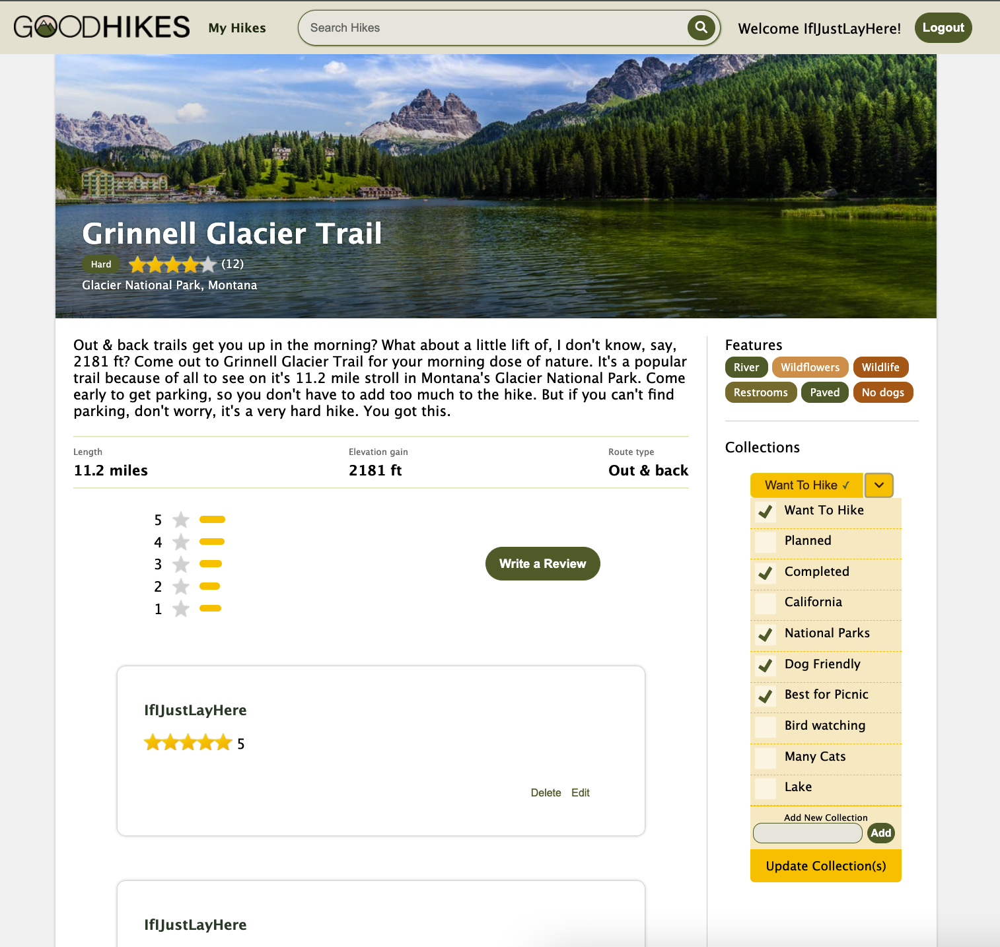

# Good Hikes

Inspired by GoodReads and AllTrails, Good Hikes is a full stack web application with a focus on usability that allows users to browse, manage, and review hikes in the USA.

- Users are not required to sign up for an account if they are just browsing and searching for hikes.
- Logged in users can add a hike to their collections, add reviews/comments to hikes, and edit/delete their own review/comments.
- Currently, Good Hikes is seeded with 60 trails all over the United States. Users `DemoUser` and `Ansel Adams` love Good Hikes so much that they visited every trail on Good Hikes and left multiple comments on each.

### Live Site:

https://good-hikes.herokuapp.com/

### Git Wiki

https://github.com/frances-y-h/good-hikes/wiki

### Main Stack Technologies:

- Javascript, Pug, Plain old vanilla CSS3, Express, Sequelize, PostgreSQL

### Good Hikes in Action:

**_Splash Page_**

**_Advanced Search Page_** - search by city name, trail name, sorting and multiple filters.

**_Hike Page_** - with review function and dropdown for adding hikes to user's collections

**_My Hikes Page_** - organizing collections of hikes

## Getting Development Environment Up And Running

- Clone this repository (only main branch) to your local machine:
  - run: `git clone https://github.com/frances-y-h/good-hikes.git`
- Install Dependencies:
  - run: `npm install` in the root directory
- Create a `.env` file that mirrors the `.env.example` file in the root directory
- Create a user in your local postgreSQL database that matches your .env
  - run: `psql -c "CREATE USER <username> WITH PASSWORD '<password>' CREATEDB"`
- Then create your database and sequelize models and seed your database
  - run: `npx dotenv sequelize` + [suffix] with each suffix in order: `create:db`, `db:migrate`, `db:seed:all`
- Start server:
  - run: `npm start` in the root directory

## Application Architecture Overview

- Good Hikes utilizes Express to serve HTML content generated via the Pug HTML template engine.
- Data is stored in PostgreSQL, an open-source object-relational database.
- For updates to pages, Good Hikes takes a hybrid approach with about 50% of updates utilizing server side rendering of new HTML. While the other 50% utilizes AJAX to fetch relevant data from the backend and frontend javascript to dynamically update portions of the DOM without refreshing the page to improve site reactivity and the user experience.

### Frontend Technologies Used:

- Pug:
  - Web pages of Good Hikes are rendered server side via Pug.js, a template engine for Node.js. Pug allows for the creation of dynamic reusable content.
- CSS:
  - Good Hikes uses vanilla CSS to style all of the HTML documents, including interactive buttons and dropdown menus.
- Javascript:
  - To improve user experience, Good Hikes uses Javascript to create a responsive experience.

### Backend Technologies Used:

- Express.js:
  - The server of Good Hikes is set up with Express JS. It is minimal and flexible enough to carry out the desired functionality while allowing for maintainable DRY code.
- Express session:
  - Good Hikes chose to use Express Sessions to create and manage session cookies on the user's browser.
- Express Validator:
  - Express Validator is powerful yet simple. Good Hikes makes sure when users are signing up, logging in, and creating new reviews, proper values have been inserted.
- PostgreSQL:
  - Good Hikes relies on PostgreSQL to maintain its relational database.
- Sequelize:
  - Sequelize makes it easy for Good Hikes to manage and query the database
- Bcrypt:
  - Good Hikes values user security, that is why all passwords are hashed by bcrypt before being stored in the database.
- CSRF Token:
  - A secure random CSRF token is generated on all forms that users fill in to prevent CSRF attacks.

## Project Challenges

- Git and Version Control

  - First team project, learning curve about proper use of feature branches, rebasing, merging, and pull requests
  - Reviewed online guides about proper git flow and worked together online in the beginning when submitting and reviewing PRs

- Search Feature

  - implement a custom search with both free text and multiple filters as well as a clear all filters functionality
  - utilized Pug template engine mixins to create dynamic DRYer html code across 8 filter types
  - utilized url query parameters, regex, raw sequel and sequelize to create custom search algorithm to query database

- Database setup

  - Missing associating in sequelize model - database setup

- USER Auth Feature

  - Demo - form submission vs ajax and window refresh fetch stops the default refresh behavior
  - csurf form submission issues
  - requireAuth middleware

- Home page Feature

- Collections Feature

  - add to collection dropdown
  - as added more dom manipulation, some buttons disappeared, better organization on selectors
  - deleting collections with associated data,

- Reviews Feature
  - adding event listeners to buttons created in front end post fetch request
  - merge conflict doubled the router code
  - updating the table after adding a review without rerendering. parent./child node (delete last and add first) vs fetch to database and refill entire table
  - re-populate and clear the data field

## Conclusion and Next Steps

The next step for Good Hikes is to build out a social network functionality, including "Friends" and "Hiking Communities". Registered users can join communities, schedule hiking events, and create posts on community pages.

Good Hikes also plans to implement a "Likes" feature to comments. Helpful comments will be rated higher. Our goal is to boost interactivity between users.
